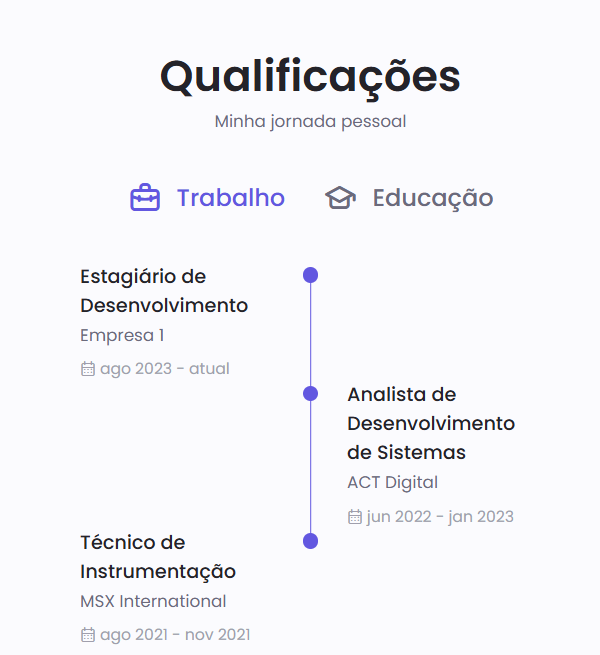

# Personal-profile-page-Html
pagina pessoal desenvolvida durante o curso HTML 5 e CSS3

Inspirações para o desing:

https://www.heltonbrito.com.br/#home

https://i.pinimg.com/736x/03/3e/a4/033ea41248940484f80888d3f4d3523b.jpg

https://joaopedrorodrigues.vercel.app/

https://www.raniery.dev/

### Atualizações:
#### Botão dark mode ✅
#### Botão switch language
https://www.youtube.com/watch?v=hBYVxQLtrqQ
#### Responsividade
#### add baixar curriculo
#### add informações no sobre:
- Anos de experiência
- Repositórios Git
- Empresas trabalhadas 
#### Add aba qualificações
inspo:

#### Add aba Portifolio com os projetos já feitos.
